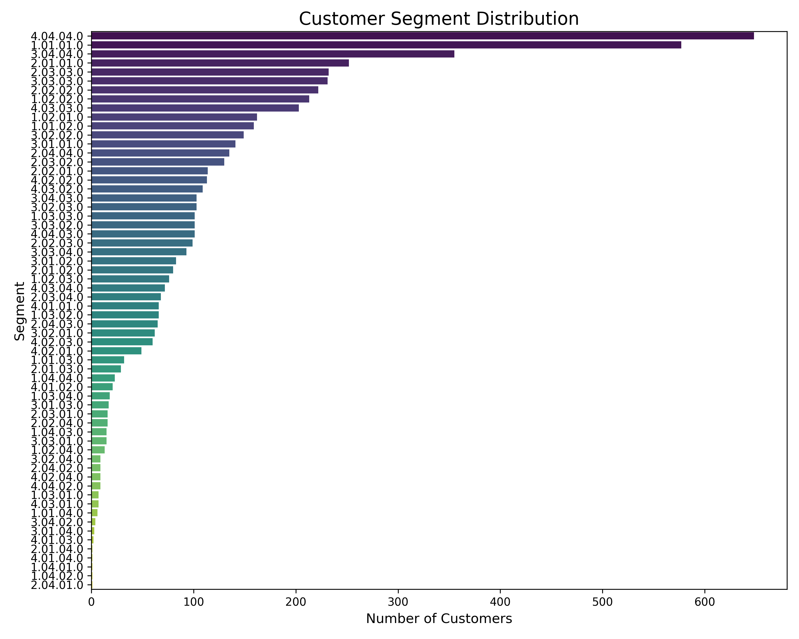

# Customer Segmentation using RFM Analysis

## Project Objective
This project performs a customer segmentation analysis on the UCI Online Retail dataset. The goal is to move beyond generic metrics and identify distinct customer groups based on their purchasing behavior. By applying RFM (Recency, Frequency, Monetary) analysis, we can uncover actionable insights for targeted marketing, improved customer retention, and optimized marketing spend.

---

## Dataset
The analysis uses the **Online Retail** dataset from the UCI Machine Learning Repository, which contains transactional data for a UK-based online retailer from 2010 to 2011.
* **Source:** [UCI Online Retail Dataset](https://archive.ics.uci.edu/ml/datasets/online+retail)

---

## Methodology
1.  **Data Cleaning:** The raw data was cleaned by removing canceled orders, handling missing `CustomerID`s, and filtering out invalid entries.
2.  **Feature Engineering:** A `TotalPrice` column was created by multiplying `Quantity` and `UnitPrice`.
3.  **RFM Calculation:** For each customer, the following metrics were calculated:
    * **Recency (R):** Days since the customer's last purchase.
    * **Frequency (F):** Total number of unique purchases made.
    * **Monetary (M):** Total monetary value of all purchases.
4.  **Scoring & Segmentation:** Customers were scored from 1-4 on each RFM metric. These scores were then used to group customers into intuitive, named segments like "Champions," "Loyal Customers," "At Risk," and "Lost."

---

## Key Insights
The RFM analysis revealed a polarized customer base with two dominant groups:
* **Champions:** A large and highly valuable group of recent, frequent, high-spending customers. They are the foundation of the business and should be nurtured with loyalty programs and exclusive offers.
* **Lost Customers:** A significant segment of customers who are inactive and have low past value. This group highlights an opportunity for low-cost automated re-engagement campaigns or a strategic decision to focus resources elsewhere.

This segmentation provides a clear roadmap for creating tailored marketing strategies to effectively engage different types of customers.

---

## Visualization
The final distribution of customers across the defined segments is shown below.

